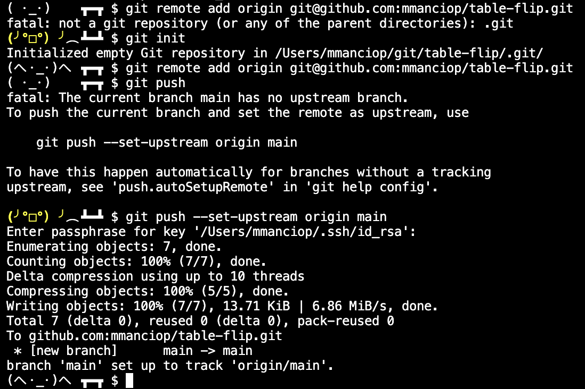

# Table-flip Shell Prompt

Have you ever worked with a piece of software?
Yes?
Then you likely have felt an irrepressible urge to flip tables.

Table-flip is a custom Linux shell prompt that lets your shell express your rage for you.

The following happened spontaneously as I was preparing this Git repository:

## Installation

Copy the content of (or source) the [`src/bash/table-flip.sh`](./src/bash/table-flip.sh) from your `~/.bashrc` or `~/.bash_profile` files.
If you are on Mac, it is [admittedly confusing which one to use](https://scriptingosx.com/2017/04/about-bash_profile-and-bashrc-on-macos/).

## How does it work

Whenever a command succeeds or fails, the `TABLE_FLIPNESS` environment variable is decreased or increased, respectively.
The prompt acts responsibly and sustainably and, over the transition from `TABLE_FLIPNESS=1` to `TABLE_FLIPNESS=0`, it puts the table back. 
